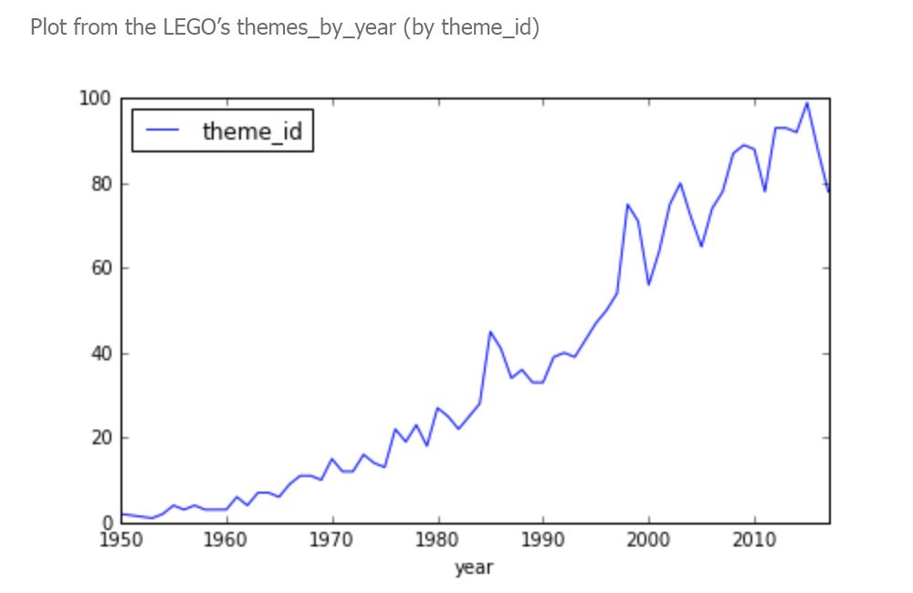

# Project: 67 Years of LEGO

## overview and exemple:

This project "EXPLORING 67 YEARS OF LEGO" is part of a course from DATACAMP. DataBase used: https://rebrickable.com/downloads/

In this project we work with a dataset on every single lego block that has ever been built! 

During this project we work concepts of Data manipulation, Data visualization and importing and cleaning data.

#### Example: 

After create a summary of the number of themes shipped by LEGO (by year) this is the plot summarizing the themes shipped per year.

